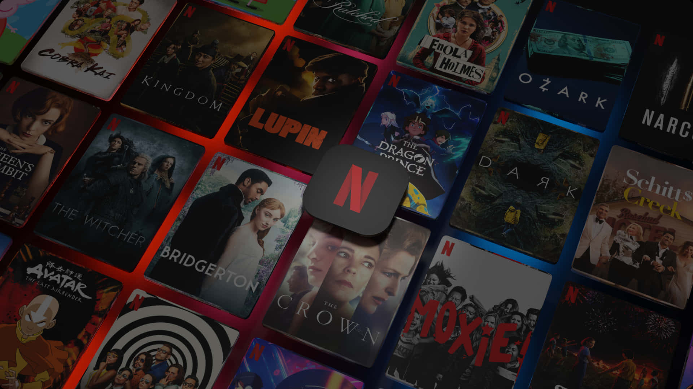

# Netflix Clone

A **responsive Netflix clone** built using **HTML, CSS, Bootstrap, and JavaScript**. This project replicates the Netflix homepage layout and includes a signup page with input validation.

---

## 🔗 Live Demo
[View Live Project](https://yourusername.github.io/netflix-clone/)  

---

## 🛠️ Technologies Used
- HTML5  
- CSS3  
- Bootstrap 5  
- JavaScript (for form validation and interactivity)  

---

## 📂 Project Structure
netflix-clone/
│── index.html
│── signup.html
│── css/
│ └── style.css
│── js/
│ └── script.js
│── images/
│ ├── netflixlogo.png
│ ├── netflixBG.jpg
│ └── poster1.jpg ...


---

## ✨ Features
- Fully responsive design for mobile, tablet, and desktop  
- Netflix-inspired homepage layout  
- Signup page with input validation using JavaScript  
- Clean, organized folder structure for maintainability  

---

## 📸 Screenshots




---

## 🚀 How to Run
1. Clone the repository:  
   ```bash
   git clone https://github.com/yourusername/netflix-clone.git
